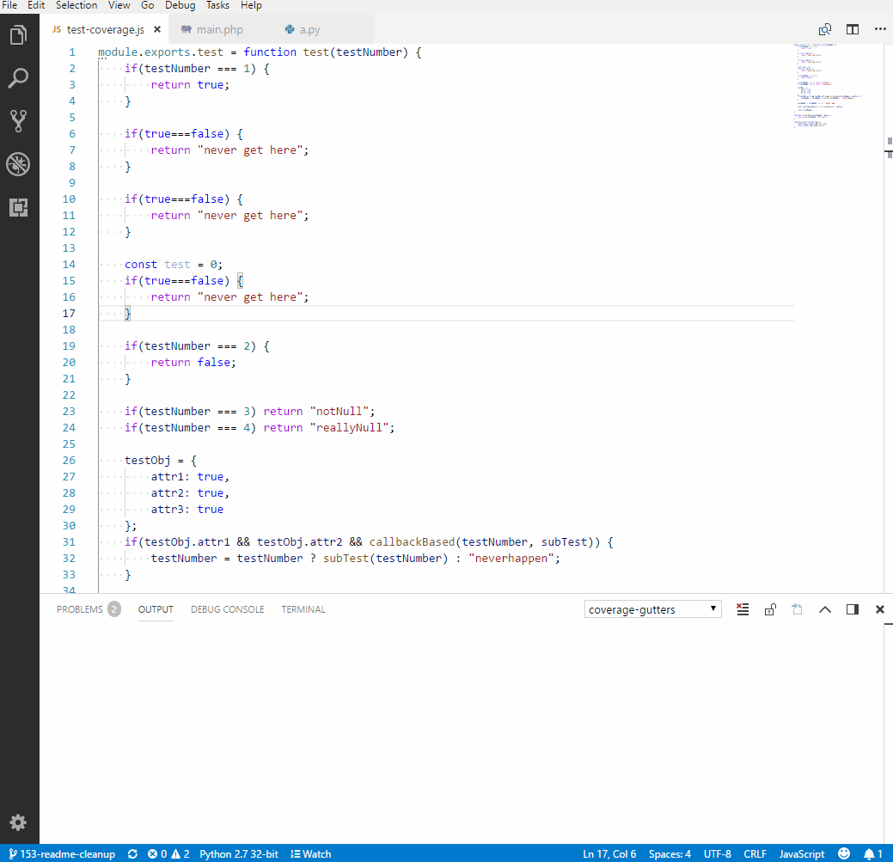

```{=html}
<style>
th { font-size: 22px; }
td { font-size: 16px; }
li { font-size: 22px; }
blockquote { font-size: 22px; }
</style>
```
<!-- section 0 -->

# Cypress

------------------------------------------------------------------------

## Praxis-Demo

Zum starten der Demo muss folgendes ausgeführt werden:

In Terminal 1:

``` {.bash}
cd nextjs-frontend
npm install
npm run build
npm run start
```

In Terminal 2:

``` {.bash}
cd nextjs-frontend
npm run cypress
```

------------------------------------------------------------------------

<!-- subsection 0 / 1 -->

## Warum Cypress?

*https://docs.cypress.io/guides/overview/why-cypress*

{width="70%"}

> -   Testen mit verschiedenen Viewports möglich
> -   Zugriff auf Local-Storage, Service-Worker, usw.

------------------------------------------------------------------------

<!-- subsection 0 / 2 -->

## Trade-Offs

> https://docs.cypress.io/guides/references/trade-offs

------------------------------------------------------------------------

**Dauerhafte Trade-Offs**

-   läuft im Browser: gut für direkten (Shadow-)DOM-Zugriff. Schlecht um Dinge außerhalb eines Browsers zu testen.
-   Kein Support für mehrere Browser-Tabs
-   Keine Automatisierung mehrerer Browser zur gleichen Zeit. Nur indirekt, z.B. weiteren Backend-Prozess mit Selenium, Puppeteer, ...
-   Jeder Test ist an einen single-origin (gleicher Port, gleiche Hauptdomain) gebunden
-   nicht gedacht für: Web-Indexing, Spidering, Performance-Testing
-   Kein natives Testen mobiler Apps möglich. Nur einfache Funktionstests, falls Mobile-App im Browser entwickelt wird (z.B. mit Ionic)
    -   Mögliche Alternativen: z.B. Appium, Detox oder Ranorex

------------------------------------------------------------------------

**Temporäre Trade-Offs**

-   Limitierter iframe-Support
-   kein cy.hover()
-   kein cy.tab()

------------------------------------------------------------------------

<!-- subsection 0 / 3 -->

## Roadmap

https://docs.cypress.io/guides/references/roadmap\#Upcoming-features

  Status         Feature                       Released
  -------------- ----------------------------- ----------
  Alpha          Component Testing             v7.0.0
  Experimental   Cypress Studio                v6.3.0
  Experimental   Session API                   v8.2.0
  in progress    WebKit Support                \-
  in progress    Visit multiple superdomains   \-
  in progress    Iframe Support                \-

------------------------------------------------------------------------

<!-- subsection 0 / 4 -->

## Disabled Barriers

> Cypress deaktiviert störende Funktionen im Auto-Test: https://docs.cypress.io/guides/guides/launching-browsers\#Disabled-Barriers

-   Ignoriert Zertifikats-Fehler
-   Erlaubt blockiert Pop-Ups
-   Deaktiviert 'Passwort speichern'
-   Deaktiviert 'Autofill für Formulare und Passwörter'
-   Deaktiviert Nachfrage nach Standbrowser
-   Deaktiviert Benachrichtigung über neu gefundene Geräte
-   Deaktiviert Browser-Übersetzungen
-   Deaktiviert Wiederherstellen von Sessions
-   Deaktiviert Hintergrund Netwerk-Verkehr
-   Deaktiviert Hintergrund und Renderer Drosselung
-   Deaktiviert Dialoge mit Berechtigungsnachfragen, z.B. für Mikrofon, Webcam, ...
-   Deaktiviert Benutzergesten für Autoplay von Videos

> kann bei Bedarf über Kommandozeilen-Parameter angepasst werden!

------------------------------------------------------------------------

### Dashboard

Real-World Beispiel:

-   Dashboard: https://dashboard.cypress.io/projects/7s5okt
-   Github-Repo: https://github.com/cypress-io/cypress-realworld-app
-   Youtube Einführung: https://www.youtube.com/watch?v=ezp60FUnjGg

------------------------------------------------------------------------

Der Cypress-Dashboard bietet u.a.:

-   Load Balancing
-   Zugriff auf aufgezeichnete Testergebnisse (typischerweise aus einer CI-Pipeline)
-   Stack-Trace fehlgeschlagener Tests
-   Screenshots fehlgeschlagener (oder per cy.screenshot() getriggert) Tests
-   Video des Test-Runs
-   Übersicht über die langsamsten Tests
-   Integration der Cypress Tests in den GitHub-Workflow mittels commit status checks: https://docs.cypress.io/guides/dashboard/github-integration\#Status-checks -\> verhindert das Mergen eines Commits oder Pull-Requests, falls nicht alle Cypress Tests passed sind.
-   Integration von Cypress in GitHub mittels Pull Requests: https://docs.cypress.io/guides/dashboard/github-integration\#Pull-request-comments
-   Integrationen für Slack, GitHub, GitLab, Bitbucket
-   Analytics (u.a. Übersicht über häufigste Fehler)

> der Free-Tier ist auf 3 User und 500 Test-Ergebnisse/Monat limitiert!

------------------------------------------------------------------------

Zusätzlich käufliche Premium-Features:

-   Flake Detection
-   Smart Orchestration
    -   Parallelization
    -   Load Balancing
    -   Run failed specs first
    -   Cancel test run when a test fails
-   Flake Mangement (coming soon)
-   Jira Integration
-   Mail-Support
-   Github-Enterprise (coming soon)
-   Gitlab for Enterprise (coming soon)
-   Single Sign-On

> https://cypress.io/pricing/

------------------------------------------------------------------------

### Component Testing (noch in Alpha-Status)

> https://docs.cypress.io/guides/component-testing/introduction

{width="80%"}

------------------------------------------------------------------------

``` {.javascript}
import * as React from "react";
import { mount } from "@cypress/react";
import Button from "./Button";

it("Button", () => {
  mount(<Button>Test button</Button>);
  cy.get("button").contains("Test button").click();
});
```

-   Komponenten können isoliert getestet werden

-   Vergleichbar mit Jest-Komponententests in Storybook

-   Aktuell verfügbar für React/Next und Vue über Webpack (Vite ist noch experimentell)

------------------------------------------------------------------------

### Visual Testing

> https://docs.cypress.io/guides/tooling/visual-testing


-   Lokal möglich, z.B. mittels https://github.com/meinaart/cypress-plugin-snapshots
-   Cloud-Anbieter:
    -   https://applitools.com/
    -   https://percy.io/
    -   https://happo.io/

------------------------------------------------------------------------

``` {.javascript}
// Beispiel: https://github.com/meinaart/cypress-plugin-snapshots
it('completes todo', () => {
  cy.visit('/');
  cy.get('.new-todo').type('write tests{enter}');
  cy.contains('.todo-list li', 'write tests');
    .find('.toggle')
    .check()
    .should('have.class', 'completed');
  // capture screenshot and compare to the baseline image
  cy.get('.todoapp').toMatchImageSnapshot({
    imageConfig: {
      threshold: 0.001,
    },
  })
})
```

------------------------------------------------------------------------

### CI/CD

-   Github-Action verfügbar: https://github.com/marketplace/actions/cypress-io

-   Gitlab: https://docs.cypress.io/guides/continuous-integration/gitlab-ci\#Basic-Setup

-   Jenkins: Testbench CS nutzt das Docker-Image in der Pipeline mit Reports im jUnit-Format

------------------------------------------------------------------------

### Code Coverage

https://docs.cypress.io/guides/tooling/code-coverage\#Introduction


------------------------------------------------------------------------

Code Coverage kann mit Istanbul angezeigt werden.

> https://istanbul.js.org/

-   Über das nyc-Modul (https://github.com/istanbuljs/nyc) dem Kommandzeilen-Interface von Istanbul

-   Über Code-Transiplierung mittels dem Babel-Plugin-Istanbul (https://github.com/istanbuljs/babel-plugin-istanbul)

------------------------------------------------------------------------

> Für .lcov coverage-Files gibt es IDE-Plugins (z.B. Coverage-Gutters)

{width="60%"}

Coverage kann auch in CI integriert werden, z.B. auf GitHub: https://www.cypress.io/blog/2019/10/22/show-code-coverage-on-gitlab-ci/

------------------------------------------------------------------------

### Reporter

> https://docs.cypress.io/guides/tooling/reporters

------------------------------------------------------------------------

#### Standard Reporter

-   Default-Reporter ist der spec-Reporter der Informationen auf STDOUT ausgibt

-   jeder Mocha-Reporter (https://mochajs.org/\#reporters) kann verwendet werden, da Cypress auf Mocha basiert

-   der TeamCity und jUnit-Reporter (wird bei TestbenchCS im Jenkins verwendet) sind bereits in Cypress integriert und müssen nicht extra installiert werden

------------------------------------------------------------------------

#### Custom Reporter

> Es können eigene Reporter erstellt werden oder Community-Reporter per NPM installiert werden, z.B.

-   HTML-Reports mittels Mochawesome: http://antontelesh.github.io/testing/2019/02/04/mochawesome-merge.html

-   Ein Beispiel für einen Custom-Reporter existiert für die TestbenchCS: https://github.com/testbench-cs-imbus/tbcs-api-cypress-parser

------------------------------------------------------------------------

### Best-Practices

> https://docs.cypress.io/guides/references/best-practices
>
> https://www.youtube.com/watch?v=5XQOK0v\_YRE

------------------------------------------------------------------------

**Die wichtigsten Best-Practices...**

-   Tests sollen unabhängig voneinander sein
    -   **Tipp:** `.only` beim Test setzen. Wird Test wiederholt grün -\>
-   Shortcuts nutzen: z.B. nur bei Login-Test selbst über UI, sonst API -\> Performance!
-   data-cy-Attribute als Selektoren nutzen
-   after/afterEach-Hook wird nicht garantiert ausgeführt. Weitere Tests sollten nicht von einem TearDown-CleanUp abhängig sein.
    -   **Besser:** before/beforeEach-Hook nutzen
-   Warten auf Events (z.B. REST-Call fertig) statt z.B. wait von 2 Sekunden -\> Flakiness!
-   Commands und Assertions abwechseln: nur das letzte Kommando wird im Fehlerfall retried!!! \> `cy.get('.list li').should('have.length', 2).find('label').should('contain', 'todo B')`
-   Bei Tests die trotz Best-Practices und Refactoring Flaky bleiben -\> Test-Retries nutzen
-   cy.clock() bei Bedarf nutzen um sporadische Timestamp-Fehler zu vermeiden

------------------------------------------------------------------------

### Plugins

-   https://docs.cypress.io/guides/tooling/plugins-guide

-   https://docs.cypress.io/plugins/directory

> Es ist möglich Cypress auch mit eigenen Plugins zu erweitern :-)

------------------------------------------------------------------------

<!-- subsection 0 / 5 -->

## Ressourcen

-   offizieller Cypress-Workshop: https://github.com/cypress-io/testing-workshop-cypress
-   Cypress Blog: https://www.cypress.io/blog
-   Recipes: https://docs.cypress.io/examples/examples/recipes
-   Chrome-Plugins (durch Cypress Studio bald überflüssig):
    -   Cypress-Recorder: https://chrome.google.com/webstore/detail/cypress-scenario-recorder/fmpgoobcionmfneadjapdabmjfkmfekb
    -   Cypress Scenario Recorder: https://chrome.google.com/webstore/detail/cypress-scenario-recorder/fmpgoobcionmfneadjapdabmjfkmfekb

------------------------------------------------------------------------

<!-- section 1 -->

# Vergleich mit anderen Tools

> https://docs.cypress.io/guides/overview/key-differences

------------------------------------------------------------------------

> Protractor mittlerweile deprecated: https://blog.angular.io/angular-v12-is-now-available-32ed51fbfd49

> Für Migrations-Projekte: https://docs.cypress.io/guides/migrating-to-cypress/protractor\#Introduction

------------------------------------------------------------------------

``` {.mermaid}
flowchart TB
        subgraph Selenium
            direction TB
            a1(Test Code)-->a2(Selenium WebDriver)-->a3(Browser)-->a4(Application)
        end

        subgraph Cypress
            direction TB
            b1(Test Code)-->b2(Cypress Framework)
            subgraph Browser
            b2-->b3(Universal)-->b4(Application)
            end
        end
```

------------------------------------------------------------------------

**Cypress:** läuft im run-loop der Applikation

**Selenium:** Sendet commands über Treiber an Browser

> Gilt analog für W3C WebDriverAPI-basierte Tools wie WebdriverIO und NightwatchJS

> Details siehe: https://www.browserstack.com/guide/cypress-vs-webdriverio

------------------------------------------------------------------------

  --------------------------------------------------------------------------------------------------------------------------------------------------------------------------------------------
                          Cypress                   Puppeteer                      Playwright                                  TestCafe
  ----------------------- ------------------------- ------------------------------ ------------------------------------------- ---------------------------------------------------------------
  Webseite                https://cypress.io        https://pptr.dev               https://playwright.dev                      https://testcafe.io

  Anforderungen           Node.js 12+               Node 10.18.1+                  Node.js 12+                                 Node.js 10+

  Browser                 Chromium, Edge, Firefox   Chromium                       Chrome/ium, Edge, Firefox, WebKit           Chromium, Edge, Firefox, Safari, IE11+, Chrome-/Safari-Mobile

  Cross-Browser Testing   nein                      nur für unterstütze Browser    ja                                          ja

  Multi-Tab Testing       nur indirekt              ja                             ja                                          ja

  direkter DOM-Zugriff    ja                        ja                             ja                                          ja

  Docker-Images           ja                        siehe Troubleshooting/Docker   ja                                          ja

  Test Recorder           Cypress Studio in alpha   ab Chrome 92: in DevTools      Playwright codegen                          kostenpflichtiger Visual Test Recorder

  Component Testing       ja                        nein                           nein                                        nein

  Visual Testing          ja                        ja                             ja                                          ja

  Parallele Tests         unterstützt je Browser    ja                             ja                                          ja

  Test Retries            ja                        ja                             ja                                          ja

  Automatic Wait          ja                        nein                           ja                                          ja

  Network Interception    ja                        ja                             ja                                          ja

  Time Travel Debugger    ja                        nein                           Trace Viewer + VS-Code-Debugging            nein

  Dashboard               ja                        nein                           nein                                        in Alpha Test

  Sprache                 JavaScript/TypeScript     JavaScript/Typescript          JavaScript/Typescript, Python, Java, .NET   JavaScript/Typescript
  --------------------------------------------------------------------------------------------------------------------------------------------------------------------------------------------

------------------------------------------------------------------------


> Lösungen mit Puppeteer, Playwright, TestCafe, WebDriver oder Appium lassen sich gut mit Codecept kombinieren: https://codecept.io

------------------------------------------------------------------------

## Fazit

-   Cypress hat eine sehr gute Dokumenation

-   leicht zu lernen

-   schnell eingerichtet (auch Pipeline)

-   viele Plugins verfügbar

-   Cypress ist sehr Developer-freundlich -\> Gut für Shift-Left!

-   Cypress hat eine andere Zielgruppe als z.B. Selenium -\> Lässt sich auch gut zusammen verwenden!

------------------------------------------------------------------------

<!-- subsection 1 / 1 -->

## Fragen?
