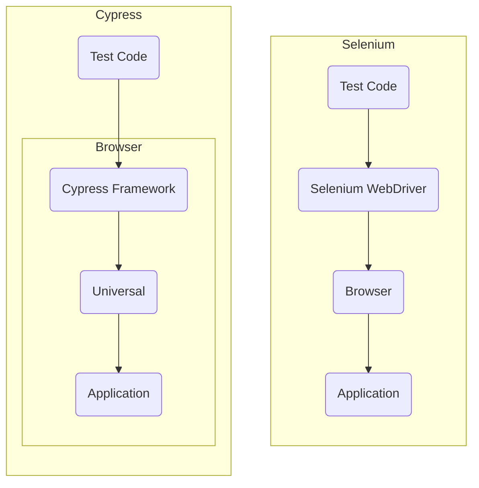

# Cypress

---

## Was ist Cypress?

https://docs.cypress.io/guides/overview/why-cypress

---

## Grundlegende Konzepte

---

https://docs.cypress.io/guides/core-concepts/introduction-to-cypress
https://docs.cypress.io/guides/core-concepts/writing-and-organizing-tests
https://docs.cypress.io/guides/core-concepts/retry-ability
https://docs.cypress.io/guides/core-concepts/interacting-with-elements
https://docs.cypress.io/guides/core-concepts/variables-and-aliases
https://docs.cypress.io/guides/core-concepts/conditional-testing
https://docs.cypress.io/guides/core-concepts/test-runner
https://docs.cypress.io/guides/core-concepts/cypress-studio

---

## Trade-Offs

https://docs.cypress.io/guides/references/trade-offs

---

## Vergleich mit anderen Tools

https://docs.cypress.io/guides/overview/key-differences

---

Protractor mittlerweile deprecated:

 https://blog.angular.io/angular-v12-is-now-available-32ed51fbfd49

***

 Für Migrations-Projekte: https://docs.cypress.io/guides/migrating-to-cypress/protractor#Introduction

---

---

|                       | Cypress                             | Selenium              | Puppeteer  | Playwright     | WebdriverIO  | TestCafe    | NightwatchJS     | CodeceptJS  | Appium |
|-----------------------|-------------------------------------|-----------------------|------------|----------------|--------------|-------------|------------------|-------------|--------|
| Webseite              | cypress.io                          | selenium.dev          | pptr.dev   | playwright.dev | webdriver.io | testcafe.io | nightwatchjs.org | codecept.io |        |
| Anforderungen         | Node.js 12+                         |                       |            |                |              |             |                  |             |        |
| Browser               | Chrome/ium, Edge, Electron, Firefox | über Driver           |            |                |              |             |                  |             |        |
| Cross-Browser Testing | nein                                |                       |            | ja             |              |             |                  |             |        |
| Mutli-Tab Testing     | nur indirekt                        |                       |            | ja             |              |             |                  |             |        |
| direkter DOM-Zugriff  | ja                                  | nein                  |            |                |              |             |                  |             |        |
| Docker-Images         | ja                                  |                       |            |                |              |             |                  |             |        |
| Parallele Tests       | unterstützt je Browser              |                       |            |                |              |             |                  |             |        |
| Test Retries          | ja                                  | nein                  |            |                |              |             |                  |             |        |
| Automatic Wait        | ja                                  | nein                  |            |                |              |             |                  |             |        |
| Time Travel Debugger  | ja                                  | nein                  |            |                |              |             |                  |             |        |
| Sprache               | JavaScript                          | Java, Python, C#, ... | JavaScript | JavaScript     | JavaScript   | JavaScript  |                  |             |        |

---

## Cypress Details

---

### Konfiguration

Animationen?

https://www.cypress.io/blog/2021/03/01/generate-high-resolution-videos-and-screenshots/

---

#### IDE

https://docs.cypress.io/guides/tooling/IDE-integration

---

### Dashboard

Real-World Beispiel:

- Dashboard: https://dashboard.cypress.io/projects/7s5okt
- Github-Repo: https://github.com/cypress-io/cypress-realworld-app
- Youtube Einführung: https://www.youtube.com/watch?v=ezp60FUnjGg

---

Der Cypress-Dashboard-Service bietet einem u.a.:

der Free-Tier ist auf 3 User und 500 Test-Ergebnisse/Monat limitiert!

- Load Balancing
- Zugriff auf aufgezeichnete Testergebnisse (typischerweise aus einer CI-Pipeline)
- Stack-Trace fehlgeschlagener Tests
- Screenshots fehlgeschlagener (oder per cy.screenshot() getriggert) Tests
- Video des Test-Runs
- Übersicht über die langsamsten Tests
- Integration der Cypress Tests in den GitHub-Workflow mittels commit status checks: https://docs.cypress.io/guides/dashboard/github-integration#Status-checks -> verhindert das Mergen eines Commits oder Pull-Requests, falls nicht alle Cypress Tests passed sind.
- Integration von Cypress in GitHub mittels Pull Requests: https://docs.cypress.io/guides/dashboard/github-integration#Pull-request-comments
- Integrationen für Slack, GitHub, GitLab, Bitbucket
- Analytics (u.a. Übersicht über häufigste Fehler)

---

Die Premium-Features enthalten zusätzlich je nach gewähltem Plan: https://cypress.io/pricing/

- Flake Detection
- Smart Orchestration
- Flake Mangement (coming soon)
- Jira Integration
- Mail-Support
- Github-Enterprise (coming soon)
- Gitlab for Enterprise (coming soon)
- Single Sign-On

---

### Component Testing

https://docs.cypress.io/guides/component-testing/introduction#What-is-Component-Testing
https://www.cypress.io/blog/2021/04/06/introducing-the-cypress-component-test-runner/
https://www.cypress.io/blog/2021/04/06/getting-start-with-cypress-component-testing-vue-2-3/
https://www.cypress.io/blog/2021/04/06/cypress-component-testing-react/

---

### Visual Testing

https://docs.cypress.io/guides/tooling/visual-testing
https://www.cypress.io/blog/2019/07/11/visual-testing-with-cypress/
https://www.cypress.io/blog/2019/04/19/webinar-recording-cypress-io-percy-end-to-end-functional-and-visual-testing-for-the-web/

---

### BDD

---

### CI/CD

- Github-Action verfügbar: https://github.com/marketplace/actions/cypress-io

https://docs.cypress.io/guides/continuous-integration/github-actions#Cypress-GitHub-Action
https://docs.cypress.io/guides/dashboard/github-integration
https://www.cypress.io/blog/2021/03/04/live-webcast-netlify-cypress/
https://www.netlify.com/blog/2021/03/11/netlify-build-plugin-of-the-week-cypress/
https://www.cypress.io/blog/2019/11/20/drastically-simplify-your-testing-with-cypress-github-action/
https://www.cypress.io/blog/2019/07/29/github-integration-for-the-cypress-dashboard/

---

#### Grundlagen

---

#### Tests aufnehmen

---

#### Parallele Tests

---

#### Arbeiten mit Docker

---

### Code Coverage

https://docs.cypress.io/guides/tooling/code-coverage#Introduction

Code Coverage kann mit Istanbul (https://istanbul.js.org/) angezeigt werden.
Dies ist über einen zusatzlichen Build-Schritt in zwei Varianten möglich:

- Über das nyc-Modul (https://github.com/istanbuljs/nyc) dem Kommandzeilen-Interface von Istanbul
- Über Code-Transiplierung mittels dem Babel-Plugin-Istanbul (https://github.com/istanbuljs/babel-plugin-istanbul)

Für .lcov coverage-Files gibt es auch Plugins für IDEs (z.B. Coverage-Gutters für VS-Code):

Coverage kann auch in CI integriert werden, z.B. auf GitHub: https://www.cypress.io/blog/2019/10/22/show-code-coverage-on-gitlab-ci/

---

### Reporter

https://docs.cypress.io/guides/tooling/reporters

---

#### Standard Reporter

- Default-Reporter ist der spec-Reporter der Informationen auf STDOUT ausgibt
- jeder Mocha-Reporter (https://mochajs.org/#reporters) kann verwendet werden, da Cypress auf Mocha basiert
- der TeamCity und jUnit-Reporter (wird bei TestbenchCS im Jenkins verwendet) sind bereits in Cypress integriert und müssen nicht extra installiert werden

---

#### Custom Reporter

Weiter Reporter können über NPM installiert werden, z.B. HTML-Reports mittels Mochawesome (http://antontelesh.github.io/testing/2019/02/04/mochawesome-merge.html)

Ein Beispiel für einen Custom-Reporter existiert für die TestbenchCS: https://github.com/testbench-cs-imbus/tbcs-api-cypress-parser

---

### Best-Practices

- siehe: https://docs.cypress.io/guides/references/best-practices
- YouTube Talk: https://www.youtube.com/watch?v=5XQOK0v_YRE

---

### Plugins

https://docs.cypress.io/guides/tooling/plugins-guide
https://www.cypress.io/blog/2017/11/22/extending-cypress-with-plugins/

- https://github.com/testing-library/cypress-testing-library

---

### Disabled Barriers

Cypress automatically disabled certain functionality that tend to get in the way of automated testing: https://docs.cypress.io/guides/guides/launching-browsers#Disabled-Barriers

- Ignores certificate errors.
- Allows blocked pop-ups.
- Disables 'Saving passwords'.
- Disables 'Autofill forms and passwords'.
- Disables asking to become your primary browser.
- Disables device discovery notifications.
- Disables language translations.
- Disables restoring sessions.
- Disables background network traffic.
- Disables background and renderer throttling.
- Disables prompts requesting permission to use devices like cameras or mics
- Disables user gesture requirements for autoplaying videos.

kann bei Bedarf über Kommandozeilen-Parameter angepasst werden!

---

### Roadmap

https://docs.cypress.io/guides/references/roadmap#Upcoming-features

| Status       | Feature                     | Released |
|--------------|-----------------------------|----------|
| Alpha        | Component Testing           | v7.0.0   |
| Experimental | Cypress Studio              | v6.3.0   |
| Experimental | Session API                 | v8.2.0   |
| in progress  | WebKit Support              | -        |
| in progress  | Visit multiple superdomains | -        |
| in progress  | Iframe Support              | -        |

---

## Ressourcen

- offizieller Cypress-Workshop: https://github.com/cypress-io/testing-workshop-cypress
- Cypress Blog: https://www.cypress.io/blog

---

## Fazit